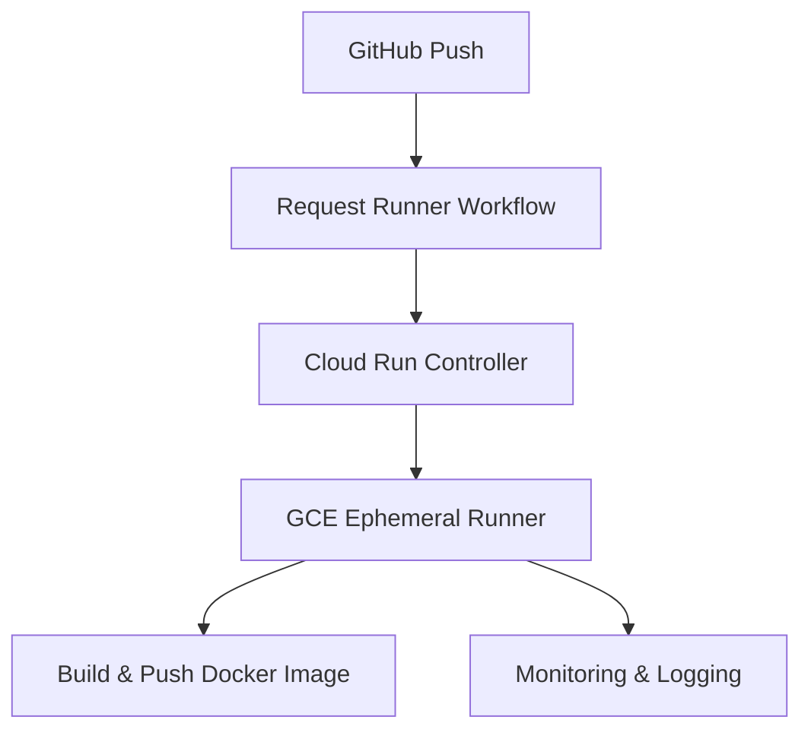
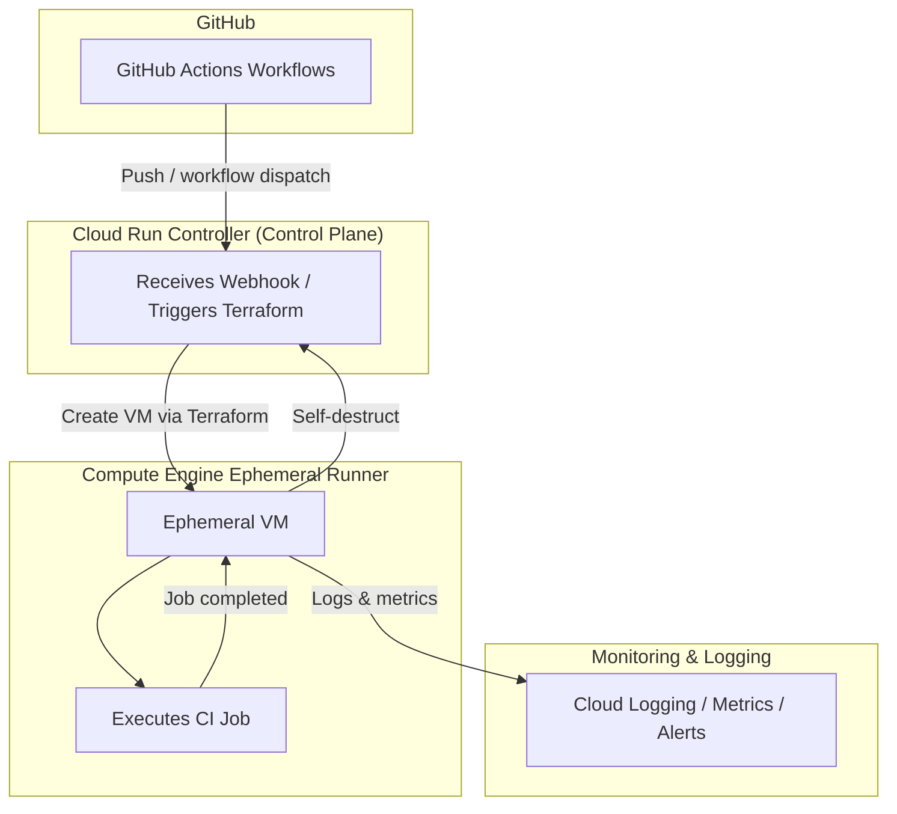

# GCP Self-Hosted CI Build Platform for GitHub Actions

## Overview

This repository implements a **production-style Continuous Integration (CI) build platform** on Google Cloud Platform (GCP).

It provisions **ephemeral GitHub Actions runners** on Google Compute Engine (GCE), executes CI workloads, builds Docker images, and publishes them to a container registry.

The platform is designed to mirror real-world **Platform Engineering** and **Enterprise CI** practices:

- Infrastructure as Code using Terraform
- Ephemeral, on-demand self-hosted runners
- Secure GitHub integration
- Artifact-centric CI pipelines (Docker images)
- Clear separation of responsibilities between CI and CD

## Benefits

- Fully automated, production-ready CI platform
- Ephemeral runners reduce cost and security risks
- Clean separation between control plane (Cloud Run) and execution plane (GCE runners)
- Full observability with log-based metrics and alerts
- Horizontally scalable: multiple ephemeral runners can be created in parallel

---

## Architecture

### Core Components

- **GitHub Actions** — source of CI workflows
- **Google Compute Engine (GCE)** — ephemeral self-hosted runners
- **Cloud Run** — controller service to manage runner lifecycle
- **Terraform** — infrastructure provisioning and lifecycle
- **Docker** — artifact packaging
- **Container Registry** — artifact storage (Docker Hub or GCP Artifact Registry)
- **Cloud Logging & Monitoring** — observability, metrics, and alerting

### High-Level Flow

1. Developer pushes code to GitHub.
2. A GitHub Actions workflow requests an ephemeral runner.
3. GitHub calls the Cloud Run controller.
4. The controller triggers Terraform to provision a short-lived GCE runner.
5. The runner registers with GitHub and executes the CI job.
6. The job builds and pushes a Docker image to a container registry.
7. The runner deregisters from GitHub and self-terminates.



### Detailed Flow



### Architecture Components

1. **Ephemeral GCE Runners**  
   - Self-hosted runners created on-demand by the Cloud Run controller.  
   - Each runner executes **one job at a time**.  
   - Automatically deregisters from GitHub and shuts down after completion.  
   - Provisioned by the Terraform module under [`terraform/gce-runners/`](terraform/gce-runners/).

2. **Cloud Run Controller**  
   - Exposes an HTTP endpoint for GitHub workflows.  
   - Validates and authenticates incoming requests.  
   - Triggers Terraform to create ephemeral GCE runners.  
   - Provides structured JSON logging for observability.  
   - Infrastructure is defined under [`terraform/cloud-run-controller/`](terraform/cloud-run-controller/).  
   - Application code lives in [`cloudrun-controller/app/app.py`](cloudrun-controller/app/app.py) with dependencies in [`cloudrun-controller/app/requirements.txt`](cloudrun-controller/app/requirements.txt).  
   - Container image is built from [`cloudrun-controller/Dockerfile`](cloudrun-controller/Dockerfile).

3. **GitHub Actions Workflows**  
   Typical workflows (not shown here) include:  
   - `request-runner.yml` — requests an ephemeral runner by calling the Cloud Run controller.  
   - `build-and-push.yml` — runs the CI job on the ephemeral runner, building and pushing a Docker image.

4. **Runner Bootstrap Script**  
   - Startup logic for GCE runners lives in [`runner/startup-script.sh`](runner/startup-script.sh).  
   - Responsibilities typically include:  
     - Downloading and configuring the GitHub Actions runner.  
     - Registering the runner with the appropriate GitHub repository/organization.  
     - Executing jobs and initiating shutdown once the job completes.

5. **Application Docker Artifact**  
   - Example application code is located in [`application/src/main.py`](application/src/main.py) with dependencies in [`application/src/requirements.txt`](application/src/requirements.txt).  
   - The Docker image is built from [`application/Dockerfile`](application/Dockerfile).  
   - Images are pushed to Docker Hub (or another compatible container registry).

6. **Monitoring & Logging**  
   - Log-based metrics and alerting rules are defined under [`terraform/monitoring/`](terraform/monitoring/).  
   - Key signals include:  
     - Runner creation / lifecycle failures.  
     - Cloud Run controller errors.  
     - Workflow-level failures.  
   - Integrated with Cloud Logging and Cloud Monitoring.

---

## Repository Structure

```text
ci-build-platform/
├── README.md
├── application/
│   ├── Dockerfile
│   └── src/
│       ├── main.py
│       └── requirements.txt
├── cloudrun-controller/
│   ├── Dockerfile
│   └── app/
│       ├── app.py
│       └── requirements.txt
├── runner/
│   └── startup-script.sh
└── terraform/
    ├── backend.tf
    ├── providers.tf
    ├── variables.tf
    ├── terraform.tfvars        # user-specific, not committed
    ├── cloud-run-controller/
    │   ├── main.tf
    │   ├── variables.tf
    │   └── outputs.tf
    ├── gce-runners/
    │   ├── main.tf
    │   ├── variables.tf
    │   └── outputs.tf
    └── monitoring/
        ├── main.tf
        ├── variables.tf
        └── outputs.tf
```

Key paths:

- Root documentation: [`README.md`](README.md)
- Sample application: [`application/`](application/)
- Cloud Run controller service: [`cloudrun-controller/`](cloudrun-controller/)
- Runner bootstrap script: [`runner/startup-script.sh`](runner/startup-script.sh)
- Terraform infrastructure: [`terraform/`](terraform/)

---

## Terraform Infrastructure

All infrastructure is managed via Terraform under [`terraform/`](terraform/).

### Root Terraform Configuration

- [`terraform/backend.tf`](terraform/backend.tf) — configures remote Terraform state (e.g., a GCS bucket such as `tf-state-ci-build-platform`).
- [`terraform/providers.tf`](terraform/providers.tf) — defines the GCP provider and any required provider settings.
- [`terraform/variables.tf`](terraform/variables.tf) — declares shared input variables for the platform.
- [`terraform/terraform.tfvars`](terraform/terraform.tfvars) — user-specific values for variables (not committed to version control).

Typical variables include (exact names may vary, see [`terraform/variables.tf`](terraform/variables.tf)):

- GCP project and region/zone.  
- Network / subnet configuration for runners.  
- GitHub organization / repository information.  
- Container registry configuration (Docker Hub or Artifact Registry).  
- Cloud Run controller configuration (service name, region, etc.).

### GCE Runner Module

Defined in [`terraform/gce-runners/`](terraform/gce-runners/):

- [`terraform/gce-runners/main.tf`](terraform/gce-runners/main.tf) — VM instance templates, instance creation logic, metadata, and wiring to the startup script.
- [`terraform/gce-runners/variables.tf`](terraform/gce-runners/variables.tf) — runner-specific parameters (machine type, image, network, labels, etc.).
- [`terraform/gce-runners/outputs.tf`](terraform/gce-runners/outputs.tf) — exported values (runner name, IP, status, etc.).

Responsibilities:

- Provision short-lived GCE VMs as ephemeral GitHub runners.
- Attach the startup script from [`runner/startup-script.sh`](runner/startup-script.sh).
- Ensure VMs are labeled and tagged for observability and cost tracking.

### Cloud Run Controller Module

Defined in [`terraform/cloud-run-controller/`](terraform/cloud-run-controller/):

- [`terraform/cloud-run-controller/main.tf`](terraform/cloud-run-controller/main.tf)
- [`terraform/cloud-run-controller/variables.tf`](terraform/cloud-run-controller/variables.tf)
- [`terraform/cloud-run-controller/outputs.tf`](terraform/cloud-run-controller/outputs.tf)

Responsibilities:

- Deploy the Cloud Run service from the image built using [`cloudrun-controller/Dockerfile`](cloudrun-controller/Dockerfile).
- Configure IAM so GitHub (or an intermediary) can securely call the controller endpoint.
- Grant the controller permission to apply Terraform changes (via service accounts / IAM roles).

### Monitoring Module

Defined in [`terraform/monitoring/`](terraform/monitoring/):

- [`terraform/monitoring/main.tf`](terraform/monitoring/main.tf)
- [`terraform/monitoring/variables.tf`](terraform/monitoring/variables.tf)
- [`terraform/monitoring/outputs.tf`](terraform/monitoring/outputs.tf)

Responsibilities:

- Create log-based metrics for:
  - Runner provisioning failures.  
  - Cloud Run controller errors.  
  - CI workflow failures.  
- Define alerting policies for critical conditions.  
- Wire metrics to Cloud Monitoring dashboards or notification channels.

---

## Project Artifacts

The platform produces and manages the following key artifacts:

- **Docker images** — built from the sample app under [`application/`](application/) and pushed to Docker Hub (or another registry).
- **Terraform state** — stored remotely (for example, in a GCS bucket configured in [`terraform/backend.tf`](terraform/backend.tf)).
- **Logs and metrics** — emitted by Cloud Run, GCE runners, and Terraform, and collected by Cloud Logging & Monitoring.

---

## Usage

### 1. Prerequisites

- A GCP project with billing enabled.
- Access to create Cloud Run services, GCE instances, and Monitoring resources.
- Terraform installed locally or in your automation environment.
- A GitHub repository where workflows will be configured.
- A container registry (Docker Hub or GCP Artifact Registry).

### 2. Configure Terraform

1. Copy or create [`terraform/terraform.tfvars`](terraform/terraform.tfvars) and populate it with values for your environment (project ID, region, GitHub settings, registry, etc.).
2. Initialize Terraform:

   ```bash
   terraform -chdir=terraform init
   ```

3. Review the plan and apply:

   ```bash
   terraform -chdir=terraform plan
   terraform -chdir=terraform apply
   ```

This will provision:

- The Cloud Run controller.  
- Supporting IAM roles and service accounts.  
- Monitoring resources (metrics, alerts).  
- Any base infrastructure required by the runner module.

### 3. Build and Deploy Controller Image

Build the controller image from [`cloudrun-controller/Dockerfile`](cloudrun-controller/Dockerfile) and push it to your registry. Then update Terraform variables (if necessary) to point the Cloud Run service to that image and re-apply Terraform.

### 4. Configure GitHub Workflows

In your GitHub repository, define workflows that:

1. **Request an Ephemeral Runner**  
   - Triggered on `push`, `pull_request`, or manual dispatch.  
   - Sends an authenticated HTTP request to the Cloud Run controller URL.  
   - Passes metadata such as repository, labels, and job identifiers.

2. **Run the CI Job on the Ephemeral Runner**  
   - Targets self-hosted runners with specific labels.  
   - Builds the Docker image from [`application/Dockerfile`](application/Dockerfile).  
   - Pushes the image to Docker Hub or your chosen registry.  
   - Optionally runs tests and static analysis.

3. **Cleanup (Implicit)**  
   - The runner VM deregisters from GitHub and self-terminates after the job completes, enforced by the logic in [`runner/startup-script.sh`](runner/startup-script.sh).

### 5. Observe and Operate

- Monitor logs and metrics via Cloud Logging & Monitoring dashboards and alerts.  
- Inspect Terraform state and apply logs to understand infrastructure changes.  
- Tune runner sizes, timeouts, and labels via variables in the Terraform modules.

---

## CI Workflow Properties

The GitHub Actions workflows (typically under `.github/workflows/`) are expected to:

1. **Request Ephemeral Runner**
   - Triggered on code push or PR events.  
   - Calls the Cloud Run controller to create a new GCE runner.

2. **Execute CI Job on Ephemeral Runner**
   - Builds the Docker image from the sample app.  
   - Pushes the image to the configured registry.

3. **Cleanup**
   - Runner deregisters from GitHub and the VM self-terminates.

### Key Properties

- **Ephemeral runners** — each job runs on a fresh GCE VM.  
- **Automated lifecycle** — runners are created and destroyed automatically.  
- **Secure registration** — runners register with GitHub using short-lived tokens.  
- **Artifact publishing** — Docker images are produced as first-class CI artifacts.

Result: CI leaves **no long-lived runner VMs** running after jobs are done.

---

## Security Model

The platform is designed following enterprise CI security practices:

- **Ephemeral runners only** — no shared, long-lived build machines.  
- **No inbound SSH** access to runner VMs.  
- **GitHub authentication tokens** stored securely (e.g., Secret Manager, GitHub Encrypted Secrets).  
- **Minimal IAM permissions** scoped to the least privileges needed.  
- **Isolated Terraform state** for the CI platform, separate from application/runtime infrastructure.  
- **Network isolation** via subnets, firewall rules, and service accounts.

This significantly reduces the blast radius of any compromise and simplifies audit and compliance.

### Required Secrets (Typical)

You will generally need the following secrets (stored in GitHub Secrets, GCP Secret Manager, or both):

- `GITHUB_TOKEN` — for ephemeral runner registration.  
- `DOCKERHUB_USERNAME` / `DOCKERHUB_TOKEN` — for pushing Docker images.  
- `CLOUD_RUN_CONTROLLER_URL` — HTTPS endpoint of the Cloud Run controller.  
- `CLOUD_RUN_TOKEN` — authentication token for calling the Cloud Run controller.

Exact names and usage can be adapted to your environment and security policies.

---

## Project Scope & Boundaries

This project implements a **Self-Hosted CI Build Platform** on GCP. Its responsibility **ends** at producing and publishing build artifacts.

### In Scope

- Self-hosted GitHub Actions runners on GCE.  
- Ephemeral runner lifecycle management.  
- Secure runner registration with GitHub.  
- Execution of CI workflows.  
- Building application artifacts (Docker images).  
- Publishing artifacts to a container registry.  
- Infrastructure provisioning and lifecycle via Terraform.

### Explicitly Out of Scope

- Application runtime infrastructure (Cloud Run, GKE, long-lived GCE workloads for the app itself).  
- Production or staging deployments of application images.  
- Release orchestration and Continuous Delivery (CD) pipelines.  
- Application-level monitoring and runtime SRE operations.

### Boundary in the Software Delivery Flow

```text
Code Push
   ↓
GitHub Actions Workflow
   ↓
Self-hosted Runner on GCE
   ↓
Build & Test
   ↓
Docker Image Published to Registry
   ↓
END OF CI PLATFORM RESPONSIBILITY
```

Any deployment or runtime execution of produced artifacts is **intentionally handled by a separate Continuous Delivery (CD) system** and is **not** part of this project.

#### Why This Boundary Matters

This split aligns with how many enterprises organize responsibilities:

- **CI platform teams** own build infrastructure and artifact production.  
- **CD / SRE / runtime platform teams** own runtime environments and deployments.  
- Terraform states are **independent** between CI infrastructure and runtime infrastructure.  
- Failures and misconfigurations are isolated, reducing blast radius.  
- Security and compliance boundaries are clearly defined.

---

## Comparison: Why Not Use the Official Google Runner Module?

Google provides an official Terraform module for GitHub Actions runners built on MIG and GKE:

- https://github.com/terraform-google-modules/terraform-google-github-actions-runners

That solution focuses on:

- Large-scale, auto-scaling runner fleets.
- Managed instance groups (MIG).
- Kubernetes-based control planes.

This project intentionally implements a **leaner alternative**:

- Direct Compute Engine runners (no MIGs, no GKE dependency).  
- Simple, transparent infrastructure you can fully inspect and modify.  
- Easier learning path for CI platform concepts on GCP.  
- High visibility into the entire runner lifecycle and control plane.

Both approaches are valid. This repository emphasizes a **small, production-style CI platform** without black-box modules, making it easier to customize, extend, and reason about.

---

## Use Cases

This project is suitable for organizations that need:

- **Isolated self-hosted runners** for security or compliance reasons.  
- **Secure build environments** with tight network and IAM controls.  
- **Custom build dependencies** that do not fit well into shared SaaS runners.  
- **Cost-controlled CI execution** by running compute only when needed.  

---

## Author

- **Name:** Dmitry Zhuravlev  
- **Role:** DevOps Engineer  

---

## License

This project is licensed under the **MIT License**.


