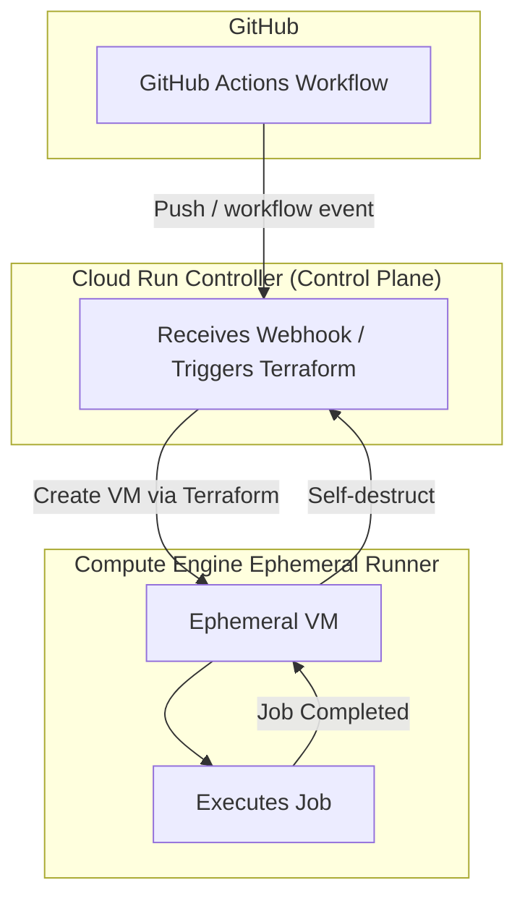

# GCP Self-Hosted CI Build Platform for GitHub Actions

## Overview

This project implements a self-hosted Continuous Integration (CI) build platform on Google Cloud Platform (GCP).

It provisions **ephemeral GitHub Actions runners** on Google Compute Engine (GCE), executes CI workloads, builds Docker images, and publishes them to a container registry.

The platform is designed to mirror real-world **Platform Engineering** and **Enterprise CI** practices:

- Infrastructure as Code using Terraform
- Ephemeral, on-demand self-hosted runners
- Secure GitHub integration
- Artifact-centric CI pipelines (Docker images)
- Clear separation of responsibilities between CI and CD

---

## Architecture

### Core Components

- **GitHub Actions** — source of CI workflows
- **Google Compute Engine (GCE)** — ephemeral self-hosted runners
- **Terraform** — infrastructure provisioning and lifecycle
- **Docker** — artifact packaging
- **Container Registry** — artifact storage (Docker Hub or GCP Artifact Registry)

### High-Level Flow

1. Developer pushes code to GitHub
2. GitHub Actions workflow is triggered
3. Workflow requests an ephemeral self-hosted runner
4. Terraform provisions a GCE VM runner
5. Runner starts, registers with GitHub, and executes the job
6. CI pipeline builds and pushes a Docker image to a registry
7. Runner self-terminates after the job completes

### Future: Cloud Run Controller (Control Plane)

The current implementation triggers Terraform directly from CI.

The architecture is intentionally designed so it can later be extended with a **Cloud Run–based controller** acting as a control plane for runner orchestration.



> **Note**: In the current state of this project, the controller is conceptual only. Terraform is invoked directly by CI, but the model aligns with a scalable, control-plane-driven pattern.

---

## Repository Structure

```text
.
├── terraform-runners/
│   ├── main.tf
│   ├── variables.tf
│   ├── terraform.tfvars.example
│   ├── backend.tf
│   └── startup-script.sh
│
├── app/
│   ├── Dockerfile
│   └── src/
│       └── main.py
│
└── README.md
```

Key paths:

- Terraform for runners: `terraform-runners/`
  - Root module: `main.tf`
  - Variables: `variables.tf`
  - Remote state backend: `backend.tf`
  - Example tfvars: `terraform.tfvars.example`
  - Startup script for runner bootstrap: `startup-script.sh`
- Sample application to build: `app/`
  - Container build: `Dockerfile`
  - Example app code: `main.py`
- Project documentation: `README.md`

---

## Terraform: Runner Infrastructure

The Terraform configuration under `terraform-runners/` provisions all infrastructure required for ephemeral GitHub Actions runners on GCE.

It manages:

- **Google Compute Engine instances** used as ephemeral runners
- **Service accounts** and **IAM permissions** needed by runners and CI
- **Network and firewall rules** to secure runner access
- **Startup scripts** for GitHub runner registration
- **Ephemeral lifecycle behavior**, including self-termination

Terraform remote state is configured to use a GCS bucket (example):

```hcl
bucket = "tf-state-ci-build-platform"
```

---

## CI Workflow

The GitHub Actions workflow (conceptually under `.github/workflows/`) performs the following steps:

1. Request a self-hosted runner for the job
2. Trigger Terraform to provision a GCE VM
3. Runner VM boots and registers with GitHub
4. Source code is checked out
5. Docker image is built from the app in `app/`
6. Image is pushed to the configured container registry
7. Runner self-terminates after the workflow completes

Result: CI leaves **no long-lived runner VMs** running after jobs are done.

---

## Security Model

The platform follows a security-conscious design typical for enterprise CI platforms:

- **Ephemeral runners only** — no shared, long-lived build machines
- **No inbound SSH** access to runner VMs
- **GitHub authentication tokens** stored securely (e.g., Secret Manager)
- **Minimal IAM permissions** scoped to required GCP resources
- **Isolated Terraform state** for the CI platform, separate from application infra

This reduces the blast radius of any compromise and simplifies compliance posture.

---

## Project Scope & Boundaries

This project implements a **Self-Hosted CI Build Platform** on GCP. Its responsibility **ends** at producing and publishing build artifacts.

### In Scope

- Self-hosted GitHub Actions runners on GCE
- Ephemeral runner lifecycle management
- Secure runner registration with GitHub
- Execution of CI workflows
- Building application artifacts (Docker images)
- Publishing artifacts to a container registry
- Infrastructure provisioning and lifecycle via Terraform

### Explicitly Out of Scope

- Application runtime infrastructure (Cloud Run, GKE, long-lived GCE workloads)
- Production or staging deployments
- Release orchestration and CD pipelines
- Application monitoring and runtime operations

### Boundary in the Software Delivery Flow

```text
Code Push
   ↓
GitHub Actions Workflow
   ↓
Self-hosted Runner on GCE
   ↓
Build & Test
   ↓
Docker Image Published to Registry
   ↓
END OF CI PLATFORM RESPONSIBILITY
```

Any deployment or runtime execution of produced artifacts is **intentionally handled by a separate Continuous Delivery (CD) system** and is **not** part of this project.

#### Why This Boundary Matters

This split aligns with how many enterprises organize responsibilities:

- **CI platform teams** own build infrastructure and artifact production
- **CD / SRE / platform runtime teams** own runtime environments and deployments
- Terraform states are **independent** between CI infra and runtime infra
- Reduced blast radius for failures and misconfigurations
- Clear **security** and **operational** boundaries

---

## Comparison: Why Not Use the Official Google Runner Module?

Google provides an official Terraform module for GitHub Actions runners built on MIG and GKE:

- https://github.com/terraform-google-modules/terraform-google-github-actions-runners

That solution focuses on:

- Large-scale, auto-scaling runner fleets
- Managed instance groups (MIG)
- Kubernetes-based control planes

This project intentionally implements a **leaner alternative**:

- Direct Compute Engine runners (no MIGs, no GKE dependency)
- Simple, transparent infrastructure you can fully inspect and understand
- Easier learning path for CI platform concepts
- High visibility into the entire runner lifecycle

Both approaches are valid. This repository emphasizes a **small, production-style CI platform** without black-box modules, making it easier to customize and reason about.

---

## Use Cases

This project is suitable for organizations that need:

- **Isolated self-hosted runners** for security or compliance
- **Secure build environments** with tight network controls
- **Custom build dependencies** that are hard to fit in shared SaaS runners
- **Cost-controlled CI execution** by running runners only when needed

---

## Author

- **Name:** Dmitry Zhuravlev  
- **Role:** DevOps  Engineer  


