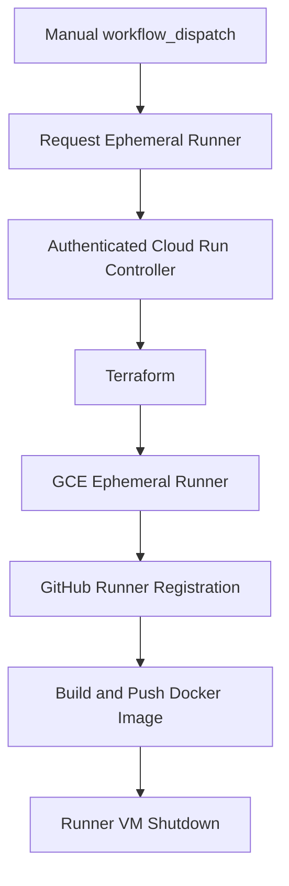
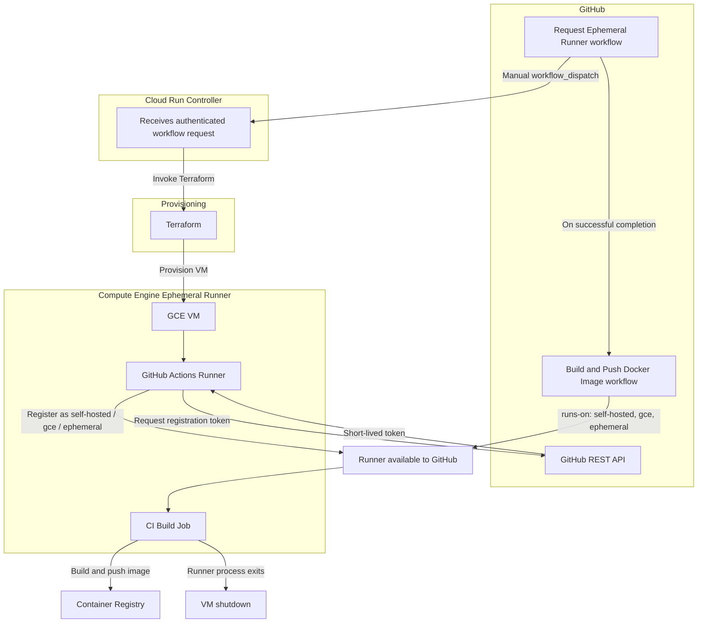

# GCP Self-Hosted CI Build Platform for GitHub Actions

## Overview

This repository implements a **production-style Continuous Integration (CI) build platform** on Google Cloud Platform (GCP).

The platform provisions **ephemeral self-hosted GitHub Actions runners** on Google Compute Engine (GCE), executes CI workloads, builds Docker images, and publishes them to a container registry.

The project demonstrates practical Platform Engineering and CI concepts, including:

- Infrastructure as Code with Terraform;
- ephemeral, on-demand self-hosted runners;
- GitHub Actions integration;
- GitHub REST API usage for runner registration;
- separation between CI infrastructure and downstream CD/runtime systems;
- explicit documentation and historical validation evidence.

> **Current operating mode:** the demo GCP infrastructure is not kept running continuously. Runner provisioning is triggered manually with `workflow_dispatch`.

## Architecture

### Core Components

- **GitHub Actions** — initiates runner provisioning and executes CI workloads.
- **Cloud Run controller** — receives an authenticated workflow request and invokes Terraform.
- **Terraform** — provisions the temporary GCE runner infrastructure.
- **Google Compute Engine (GCE)** — hosts the ephemeral self-hosted runner.
- **GitHub REST API** — provides the short-lived registration token used by the runner.
- **Docker** — packages the sample application as a container image.
- **Container registry** — stores the resulting image; the current workflow uses Docker Hub.

### High-Level Flow

1. An operator manually starts the **Request Ephemeral Runner** workflow with `workflow_dispatch`.
2. The workflow sends an authenticated request to the Cloud Run controller.
3. The controller invokes Terraform to provision the GCE runner.
4. During startup, the runner requests a short-lived GitHub registration token.
5. The runner registers with GitHub as an ephemeral self-hosted runner.
6. After the request workflow succeeds, the **Build and Push Docker Image** workflow can run on `[self-hosted, gce, ephemeral]`.
7. The CI job builds and pushes the Docker image.
8. After the runner process exits, the runner VM is shut down.


```mermaid
flowchart TD
    A[Manual workflow_dispatch] --> B[Request Ephemeral Runner]
    B --> C[Authenticated Cloud Run Controller]
    C --> D[Terraform]
    D --> E[GCE Ephemeral Runner]
    E --> F[GitHub Runner Registration]
    F --> G[Build and Push Docker Image]
    G --> H[Runner VM Shutdown]
```

### Detailed Flow


```mermaid
flowchart TB
    subgraph GitHub["GitHub"]
        Request[Request Ephemeral Runner workflow]
        API[GitHub REST API]
        Build[Build and Push Docker Image workflow]
    end

    subgraph Controller["Cloud Run Controller"]
        CR[Receives authenticated workflow request]
    end

    subgraph Provisioning["Provisioning"]
        TF[Terraform]
    end

    subgraph Runner["Compute Engine Ephemeral Runner"]
        VM[GCE VM]
        Agent[GitHub Actions Runner]
        Job[CI Build Job]
    end

    Request -->|Manual workflow_dispatch| CR
    CR -->|Invoke Terraform| TF
    TF -->|Provision VM| VM
    VM --> Agent
    Agent -->|Request registration token| API
    API -->|Short-lived token| Agent
    Agent -->|Register as self-hosted / gce / ephemeral| GitHubReady[Runner available to GitHub]
    Request -->|On successful completion| Build
    Build -->|runs-on: self-hosted, gce, ephemeral| GitHubReady
    GitHubReady --> Job
    Job -->|Build and push image| Registry[Container Registry]
    Job -->|Runner process exits| Shutdown[VM shutdown]
```

## GitHub API Integration

This platform integrates with GitHub Actions and the GitHub REST API to provision ephemeral GCE-based self-hosted runners.

During runner startup, the project uses:

`POST /repos/{owner}/{repo}/actions/runners/registration-token`

The short-lived token returned by GitHub is passed to the GitHub Actions runner configuration process so the temporary runner can register with the target repository.

See:

- [`docs/github-integration.md`](docs/github-integration.md) — integration design and security model;
- [`docs/github-integration-validation.md`](docs/github-integration-validation.md) — verified historical workflow-run evidence.

## Architecture Components

### 1. Ephemeral GCE Runner

Runner startup logic lives in [`runner/startup-script.sh`](runner/startup-script.sh).

The current implementation:

- downloads and configures the GitHub Actions runner;
- requests a short-lived runner registration token through the GitHub REST API;
- registers the runner with `gce` and `ephemeral` labels;
- configures the runner as ephemeral;
- executes the assigned CI workload;
- shuts down the VM after the runner process exits.

### 2. Cloud Run Controller

The controller application lives under [`cloudrun-controller/`](cloudrun-controller/).

Its role is to:

- expose the HTTP endpoint called by the request workflow;
- validate the controller credential supplied by the workflow;
- invoke Terraform for runner provisioning;
- return a structured HTTP response to the caller.

### 3. GitHub Actions Workflows

The repository uses two primary workflows:

- [`.github/workflows/request-runner.yml`](.github/workflows/request-runner.yml) — manually requests ephemeral runner capacity through the Cloud Run controller;
- [`.github/workflows/build-and-push.yml`](.github/workflows/build-and-push.yml) — runs the CI workload on `[self-hosted, gce, ephemeral]`.

The build job is conditioned on successful completion of the runner-request workflow.

### 4. Terraform

Terraform definitions under [`terraform/`](terraform/) manage the infrastructure used by the platform.

The repository includes modules for:

- Cloud Run controller infrastructure;
- GCE runner infrastructure;
- supporting IAM and shared configuration;
- monitoring-related definitions.

The GitHub integration validation documented in this repository focuses on the runner-request and CI execution flow. Monitoring and alerting are **not used as evidence for the GitHub Developer Program integration claim**.

### 5. Sample Application and Artifact

The sample application is located under [`application/`](application/).

The build workflow:

1. checks out the repository;
2. authenticates to Docker Hub;
3. builds the sample application image;
4. pushes the resulting image to the configured Docker Hub repository.

## Repository Structure

```text
ci-build-platform/
├── .github/
│   └── workflows/
│       ├── request-runner.yml
│       └── build-and-push.yml
├── README.md
├── SUPPORT.md
├── docs/
│   ├── deployment_guide.md
│   ├── github-integration.md
│   ├── github-integration-validation.md
│   ├── troubleshooting.md
│   └── assets/
├── application/
│   ├── Dockerfile
│   └── src/
│       ├── main.py
│       └── requirements.txt
├── cloudrun-controller/
│   ├── Dockerfile
│   └── app/
│       ├── app.py
│       └── requirements.txt
├── runner/
│   └── startup-script.sh
└── terraform/
    ├── backend.tf
    ├── providers.tf
    ├── variables.tf
    ├── cloud-run-controller/
    ├── gce-runners/
    └── monitoring/
```

Key documentation:

- [`README.md`](README.md)
- [`docs/github-integration.md`](docs/github-integration.md)
- [`docs/github-integration-validation.md`](docs/github-integration-validation.md)
- [`docs/deployment_guide.md`](docs/deployment_guide.md)
- [`docs/troubleshooting.md`](docs/troubleshooting.md)
- [`SUPPORT.md`](SUPPORT.md)

## Deployment Model

### Prerequisites

To deploy the platform, you need:

- a GCP project with billing enabled;
- permission to create the required Cloud Run, GCE, IAM, and related resources;
- Terraform;
- a GitHub repository with Actions enabled;
- the required GitHub and controller credentials;
- a container registry account.

### High-Level Setup

1. Configure the Terraform backend, providers, and variables.
2. Provision the controller and runner infrastructure.
3. Build and publish the Cloud Run controller image.
4. Configure the required GitHub Actions secrets.
5. Manually run **Request Ephemeral Runner**.
6. After the request workflow succeeds, allow the build workflow to execute on the registered self-hosted runner.
7. Verify the produced container image and runner shutdown behavior.

For detailed deployment instructions, see [`docs/deployment_guide.md`](docs/deployment_guide.md).

## CI Workflow Properties

### Request Ephemeral Runner

The request workflow:

- is triggered manually with `workflow_dispatch`;
- calls the Cloud Run controller using an authenticated request;
- requests provisioning of the temporary GCE runner.

Automatic push-based provisioning is intentionally disabled because the demo GCP infrastructure is not kept running continuously.

### Build and Push Docker Image

The build workflow:

- is triggered by completion of **Request Ephemeral Runner**;
- executes the build job only when the preceding request workflow completed successfully;
- targets `[self-hosted, gce, ephemeral]`;
- checks out the source;
- builds the Docker image;
- pushes the image to Docker Hub.

### Cleanup

The runner is configured as ephemeral, and the VM shutdown path is initiated after the runner process exits.

## Validation

Historical successful GitHub Actions runs demonstrate that the runner-request and CI build workflows have completed successfully as a linked flow.

The verified runs are documented in:

[`docs/github-integration-validation.md`](docs/github-integration-validation.md)

That document intentionally distinguishes between:

- evidence directly visible in GitHub Actions metadata;
- behavior established by the repository implementation;
- behavior that cannot be independently inferred from workflow status alone.

## Security Model

The repository demonstrates several security-oriented design choices:

- short-lived GitHub runner registration tokens;
- ephemeral self-hosted runners;
- controller and runner responsibilities separated across different service accounts;
- sensitive credentials kept outside committed source code;
- authenticated access to the Cloud Run controller;
- temporary runner lifecycle rather than a permanently shared build host.

Exact IAM configuration and credential setup are documented in [`docs/deployment_guide.md`](docs/deployment_guide.md).

## Project Scope and Boundaries

This project implements a **CI build platform**.

### In Scope

- GitHub Actions integration;
- GitHub REST API runner registration;
- ephemeral self-hosted runners on GCE;
- Cloud Run controller;
- Terraform-based provisioning;
- CI workload execution;
- Docker image creation;
- container image publishing.

### Out of Scope

- long-running application runtime infrastructure;
- production or staging application deployment;
- release orchestration;
- Continuous Delivery (CD);
- application-level SRE operations.

### Delivery Boundary

```text
Manual Runner Request
        ↓
GitHub Actions
        ↓
Ephemeral Self-Hosted Runner on GCE
        ↓
Build
        ↓
Container Image Published
        ↓
END OF CI PLATFORM RESPONSIBILITY
```

Downstream deployment and runtime operations are intentionally handled outside this repository.

## Why a Custom Runner Platform?

Google and the broader Terraform ecosystem provide reusable approaches for running GitHub Actions runners at scale.

This project intentionally takes a smaller, transparent approach:

- direct GCE-based ephemeral runners;
- no GKE dependency for the runner control plane;
- explicit Cloud Run controller;
- inspectable Terraform and bootstrap logic;
- clear visibility into the runner registration and lifecycle path.

The goal is not to replace large-scale managed runner solutions, but to demonstrate the architecture and operational mechanics of a self-hosted ephemeral runner platform.

## Use Cases

The architecture is relevant to scenarios that need:

- isolated self-hosted CI execution;
- custom build environments;
- temporary compute instead of permanently running build hosts;
- explicit control over the runner lifecycle;
- GCP-hosted CI infrastructure integrated with GitHub Actions.

## Project Status

This is a working engineering project with an implemented GitHub REST API integration and documented historical validation.

The demo GCP infrastructure is not kept running continuously. The current repository configuration therefore uses manual runner provisioning through `workflow_dispatch`.

## License

This project is licensed under the **MIT License**.

## Support

For support information, see [`SUPPORT.md`](SUPPORT.md).
