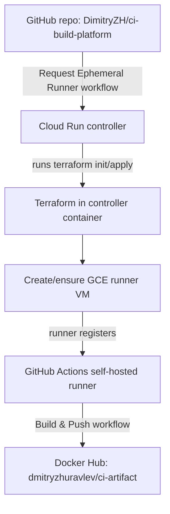

## End-to-End Deployment Guide

This guide describes how to deploy the GCP self-hosted CI build platform using:

- GCP project: `ci-build-platform`
- GitHub repo: `DimitryZH/ci-build-platform`
- Docker Hub user: `dmitryzhuravlev`

Key repo files:

- Root Terraform entry: `terraform/main.tf`
- Backend/state config: `terraform/backend.tf`
- Shared variables: `terraform/variables.tf`
- GCE runner module: `terraform/gce-runners/main.tf`
- Cloud Run controller module: `terraform/cloud-run-controller/main.tf`
- Monitoring module: `terraform/monitoring/main.tf`
- Controller Dockerfile: `cloudrun-controller/Dockerfile`
- Sample app Dockerfile: `application/Dockerfile`
- Controller app: `cloudrun-controller/app/app.py`
- Startup script: `runner/startup-script.sh`
- Workflows: `.github/workflows/request-runner.yml`, `.github/workflows/build-and-push.yml`

High-level flow:



---

## 0. Local prerequisites (on your workstation)

Install CLI tools and authenticate once:

```bash
# Install / update gcloud and Terraform as needed (manual per OS)

# Authenticate gcloud (ADC for Terraform)
gcloud auth login
gcloud auth application-default login
gcloud config set project ci-build-platform
```

Also ensure Docker is installed and you’re logged into Docker Hub locally:

```bash
docker login -u dmitryzhuravlev
```

From now on, run all commands in the repo root directory `ci-build-platform/`.

---

## 1. Prepare GCP project & enable APIs

In project `ci-build-platform`, enable required APIs:

```bash
gcloud services enable \
  compute.googleapis.com \
  run.googleapis.com \
  iam.googleapis.com \
  logging.googleapis.com \
  monitoring.googleapis.com \
  cloudresourcemanager.googleapis.com \
  serviceusage.googleapis.com
```

These APIs are needed for:

- Compute Engine runners (Terraform GCE module)
- Cloud Run controller service
- IAM and project metadata
- Logging & Monitoring resources

---

## 2. Create Terraform state bucket (matches backend.tf)

Backend config (`terraform/backend.tf`):

```hcl
terraform {
  backend "gcs" {
    bucket  = "ci-platform-tf-state"
    prefix  = "global"
  }
}
```

Create that bucket in your project (pick a region, e.g. `us-central1`):

```bash
gsutil mb -p ci-build-platform -l us-central1 gs://ci-platform-tf-state
```

If the bucket already exists, you can skip this step.

---

## 3. Create service accounts and IAM

We need two service accounts:

- **Runner SA** – used by the GCE VM runner
- **Controller SA** – used by the Cloud Run controller to run Terraform and manage infra

### 3.1 Create service accounts

```bash
# Runner SA
gcloud iam service-accounts create ci-runner-sa \
  --display-name "CI GCE Runner SA"

# Controller SA
gcloud iam service-accounts create ci-controller-sa \
  --display-name "CI Cloud Run Controller SA"
```

Emails:

- Runner SA: `ci-runner-sa@ci-build-platform.iam.gserviceaccount.com`
- Controller SA: `ci-controller-sa@ci-build-platform.iam.gserviceaccount.com`

These values will be referenced in `terraform/terraform.tfvars`.

### 3.2 Grant roles to runner SA

Runner VM needs to write logs and metrics and access basic compute metadata. Assign minimal roles (tighten later if desired):

```bash
gcloud projects add-iam-policy-binding ci-build-platform \
  --member="serviceAccount:ci-runner-sa@ci-build-platform.iam.gserviceaccount.com" \
  --role="roles/logging.logWriter"

gcloud projects add-iam-policy-binding ci-build-platform \
  --member="serviceAccount:ci-runner-sa@ci-build-platform.iam.gserviceaccount.com" \
  --role="roles/monitoring.metricWriter"
```

Terraform attaches this SA to the instance with broad scopes (see GCE runner module):

```hcl
service_account {
  email  = var.service_account_email
  scopes = ["cloud-platform"]
}
```

### 3.3 Grant roles to controller SA

Controller SA must:

- Apply Terraform (manage compute, IAM bindings for runner SA, monitoring)
- Read/write the Terraform state bucket
- Read/update the Cloud Run service it manages
- Read/update log-based metrics

Recommended roles (start broader, then refine):

```bash
# Compute admin for creating/updating VM runners
gcloud projects add-iam-policy-binding ci-build-platform \
  --member="serviceAccount:ci-controller-sa@ci-build-platform.iam.gserviceaccount.com" \
  --role="roles/compute.admin"

# Cloud Run admin so Terraform inside the controller can read/update the service itself
gcloud projects add-iam-policy-binding ci-build-platform \
  --member="serviceAccount:ci-controller-sa@ci-build-platform.iam.gserviceaccount.com" \
  --role="roles/run.admin"

# IAM serviceAccountUser on runner SA (controller acts as the runner SA for the VM)
gcloud iam service-accounts add-iam-policy-binding \
  ci-runner-sa@ci-build-platform.iam.gserviceaccount.com \
  --member="serviceAccount:ci-controller-sa@ci-build-platform.iam.gserviceaccount.com" \
  --role="roles/iam.serviceAccountUser"

# IAM serviceAccountUser on the controller SA itself (Cloud Run needs this to run as that SA)
gcloud iam service-accounts add-iam-policy-binding \
  ci-controller-sa@ci-build-platform.iam.gserviceaccount.com \
  --member="serviceAccount:ci-controller-sa@ci-build-platform.iam.gserviceaccount.com" \
  --role="roles/iam.serviceAccountUser"

# Logging/monitoring for controller logs and metrics
gcloud projects add-iam-policy-binding ci-build-platform \
  --member="serviceAccount:ci-controller-sa@ci-build-platform.iam.gserviceaccount.com" \
  --role="roles/logging.logWriter"

gcloud projects add-iam-policy-binding ci-build-platform \
  --member="serviceAccount:ci-controller-sa@ci-build-platform.iam.gserviceaccount.com" \
  --role="roles/monitoring.editor"

# Logging config writer for log-based metrics (ci_runner_errors, ci_controller_errors)
gcloud projects add-iam-policy-binding ci-build-platform \
  --member="serviceAccount:ci-controller-sa@ci-build-platform.iam.gserviceaccount.com" \
  --role="roles/logging.configWriter"

# Access to Terraform state bucket
gsutil iam ch \
  serviceAccount:ci-controller-sa@ci-build-platform.iam.gserviceaccount.com:objectAdmin \
  gs://ci-platform-tf-state
```

These roles are sufficient for the controller to run Terraform with the configs under [`terraform/`](terraform/main.tf:1) and to manage the Cloud Run service, GCE runner, and monitoring metrics without 403 errors.

---

## 4. Build and push Cloud Run controller image (Docker Hub)

The controller image is defined in `cloudrun-controller/Dockerfile`.

From repo root:

```bash
docker build \
  -t dmitryzhuravlev/ci-runner-controller:latest \
  -f cloudrun-controller/Dockerfile .

docker push dmitryzhuravlev/ci-runner-controller:latest
```

You’ll reference this image in `controller_image` inside Terraform variables.

---

## 5. Configure terraform/terraform.tfvars and sensitive variables

File `terraform/terraform.tfvars` is gitignored but required. It must satisfy **non-sensitive** variables in [`terraform/variables.tf`](terraform/variables.tf:1).

Create `terraform/terraform.tfvars` with content like:

```hcl
# terraform/terraform.tfvars

project_id  = "ci-build-platform"
region      = "us-central1"
zone        = "us-central1-a"
environment = "dev"

# GitHub repo where runners register
github_org  = "DimitryZH"
github_repo = "ci-build-platform"

# Service accounts
runner_service_account_email      = "ci-runner-sa@ci-build-platform.iam.gserviceaccount.com"
controller_service_account_email  = "ci-controller-sa@ci-build-platform.iam.gserviceaccount.com"

# Controller container image (on Docker Hub)
controller_image = "dmitryzhuravlev/ci-runner-controller:latest"

# Optional: Monitoring notification channels (leave empty for now)
notification_channels = []
```

Sensitive variables are **not** stored in `terraform.tfvars`. They are provided via environment variables when running Terraform:

- [`variable "github_token"`](terraform/variables.tf:44) – GitHub PAT used by the runner VM to register with GitHub Actions.
- [`variable "controller_token"`](terraform/variables.tf:55) – shared secret used by the controller application to validate the `X-Controller-Token` request header.

Provide them as `TF_VAR_*` when running Terraform locally:

```bash
export TF_VAR_github_token=ghp_your_classic_or_finegrained_pat_here
export TF_VAR_controller_token=super-long-random-secret-string

terraform -chdir=terraform init
terraform -chdir=terraform plan
terraform -chdir=terraform apply
```

On Windows use:

```bash
set TF_VAR_github_token=ghp_your_classic_or_finegrained_pat_here
set TF_VAR_controller_token=super-long-random-secret-string

terraform -chdir=terraform init
terraform -chdir=terraform plan
terraform -chdir=terraform apply
```

Notes:

- `github_token` is injected into the runner startup via the GCE module [`terraform/gce-runners/main.tf`](terraform/gce-runners/main.tf) and [`runner/startup-script.sh`](runner/startup-script.sh:37) so the VM can request a short-lived registration token from the GitHub API.
- `controller_token` is provided to Terraform through `TF_VAR_controller_token`, exposed to the controller as `GITHUB_CONTROLLER_TOKEN` (via [`terraform/cloud-run-controller/main.tf`](terraform/cloud-run-controller/main.tf)), and must match the `CLOUD_RUN_TOKEN` GitHub secret.
  - Do **not** store either token in `terraform.tfvars` or in the repo; keep them in a password manager and pass via environment variables.

### 5.1 Create the GitHub token for runners

For the runner to register with GitHub you need a PAT that can call the runners API for `DimitryZH/ci-build-platform`:

Two supported options:

1. **Classic PAT (simpler)**

   - Go to **Settings → Developer settings → Personal access tokens → Tokens (classic)**.
   - Generate a new token.
   - Scopes (for a public repo):
     - Check **`public_repo`** ("Access public repositories").
   - For a private repo: check **`repo`** instead.
   - Use this value as `TF_VAR_github_token`.

2. **Fine-grained PAT**

   - Go to **Personal access tokens → Fine-grained tokens**.
   - Resource owner: your user.
   - Repository access: select `DimitryZH/ci-build-platform`.
   - Repository permissions:
     - **Actions: Read and write**.
     - **Administration: Read and write** (or the specific self-hosted runners permission, if visible).
   - Use this token as `TF_VAR_github_token`.

You can verify the token by calling the registration-token API from your machine:

```bash
curl -s -X POST \
  -H "Authorization: token $TF_VAR_github_token" \
  -H "Accept: application/vnd.github+json" \
  https://api.github.com/repos/DimitryZH/ci-build-platform/actions/runners/registration-token
```

You should see JSON with a non-empty `"token"` field and no `"Bad credentials"` or `"Resource not accessible by personal access token"` errors.

---

## 6. Run Terraform (provision controller + base infra)

From repo root:

```bash
terraform -chdir=terraform init
terraform -chdir=terraform plan
terraform -chdir=terraform apply
```

`terraform/main.tf` wires the modules:

- GCE runners: `terraform/gce-runners/main.tf`
- Cloud Run controller: `terraform/cloud-run-controller/main.tf`
- Monitoring: `terraform/monitoring/main.tf`

On successful apply you will get outputs including the controller URL, defined as `controller_url` in `terraform/cloud-run-controller/outputs.tf`.

You can fetch it anytime with:

```bash
terraform -chdir=terraform output controller_url
```

Use `-raw` if you want the plain string:

```bash
terraform -chdir=terraform output -raw controller_url
```

---

## 7. Configure GitHub repository secrets

Open GitHub for `DimitryZH/ci-build-platform` → **Settings → Secrets and variables → Actions** and create these repository secrets:

1. `CLOUD_RUN_CONTROLLER_URL`

   - Value: output of

     ```bash
     terraform -chdir=terraform output -raw controller_url
     ```

2. `CLOUD_RUN_TOKEN`

   - Value: **exactly the same** as the `controller_token` value supplied to Terraform through `TF_VAR_controller_token`.

3. `DOCKERHUB_USERNAME`

   - Value: `dmitryzhuravlev`

4. `DOCKERHUB_TOKEN`

   - Value: Docker Hub access token (recommended) or password.

These are used in:

- `.github/workflows/request-runner.yml`
- `.github/workflows/build-and-push.yml`

The request workflow calls the controller:

```yaml
- name: Request GCE runner from Cloud Run controller
  run: |
    curl -X POST \
      -H "X-Controller-Token: ${{ secrets.CLOUD_RUN_TOKEN }}" \
      -H "Content-Type: application/json" \
      ${{ secrets.CLOUD_RUN_CONTROLLER_URL }}/run
```

The Cloud Run service accepts the HTTP request, and the controller application validates the shared `X-Controller-Token` header. This is application-level shared-secret validation, not Cloud Run IAM caller authentication.

The build workflow uses your Docker Hub credentials:

```yaml
- name: Log in to Docker Hub
  uses: docker/login-action@v3
  with:
    username: ${{ secrets.DOCKERHUB_USERNAME }}
    password: ${{ secrets.DOCKERHUB_TOKEN }}

- name: Build Docker image
  run: |
    docker build \
      -f application/Dockerfile \
      -t ${{ secrets.DOCKERHUB_USERNAME }}/ci-artifact:latest \
      application

- name: Push Docker image
  run: |
    docker push ${{ secrets.DOCKERHUB_USERNAME }}/ci-artifact:latest
```

---

## 8. Trigger workflows and validate end-to-end

### 8.1 Trigger the Request Ephemeral Runner workflow

`Request Ephemeral Runner` (`.github/workflows/request-runner.yml`) runs on:

```yaml
on:
  workflow_dispatch:
```

You can trigger it manually from GitHub:

1. **Manually from GitHub UI**

   - Go to **Actions → Request Ephemeral Runner → Run workflow**.
   - Choose branch `main` and click **Run**.

Expected behavior:

- GitHub runs the `curl` step calling the Cloud Run controller `/run` endpoint.
- The Flask controller app (`cloudrun-controller/app/app.py`) verifies `X-Controller-Token` and then executes:

  ```python
  subprocess.check_call(["terraform", "init"], cwd=tf_dir)
  subprocess.check_call(["terraform", "apply", "-auto-approve"], cwd=tf_dir)
  ```

- Terraform (inside the controller container) ensures the infrastructure, including the `google_compute_instance.runner` resource, exists.
- GCE VM boots, runs `runner/startup-script.sh`, installs GitHub Actions runner, and registers with labels `gce,ephemeral`.
- The GitHub runner registration is ephemeral. After the job, the startup script shuts down the VM, while the Terraform-managed GCE instance resource may remain in a stopped state.

You can observe:

- GCE instances in Cloud Console → **Compute Engine → VM instances**.
- Cloud Run logs for `ci-runner-controller` (to see Terraform output and errors).

### 8.2 Verify GitHub sees the self-hosted runner

In the GitHub repo `DimitryZH/ci-build-platform`:

- Go to **Settings → Actions → Runners**.
- You should see a runner online with labels:
  - `self-hosted`
  - `gce`
  - `ephemeral`

These labels are configured by `runner/startup-script.sh` when running `config.sh`:

```bash
sudo -u ubuntu ./config.sh \
  --url https://github.com/${GITHUB_ORG}/${GITHUB_REPO} \
  --token ${REG_TOKEN} \
  --name ${RUNNER_NAME} \
  --labels gce,ephemeral \
  --unattended \
  --ephemeral
```

### 8.3 Build & Push workflow

The build workflow (`.github/workflows/build-and-push.yml`) is configured to run when the Request workflow completes successfully:

```yaml
on:
  workflow_run:
    workflows: ["Request Ephemeral Runner"]
    types:
      - completed

jobs:
  build:
    if: ${{ github.event.workflow_run.conclusion == 'success' }}
    runs-on: [self-hosted, gce, ephemeral]
```

Once `Request Ephemeral Runner` completes:

- GitHub schedules the **Build and Push Docker Image** job on the self-hosted runner.
- On that VM, it will:
  - Check out code.
  - Log into Docker Hub.
  - Build the image from `application/Dockerfile`.
  - Push `dmitryzhuravlev/ci-artifact:latest` to Docker Hub.

Validate by checking Docker Hub:

- Repository: `dmitryzhuravlev/ci-artifact`.
- Tag: `latest` should exist and be updated after the workflow.

---

## 9. Observability & monitoring

Monitoring resources in `terraform/monitoring/main.tf` create:

- Log-based metric `ci_runner_errors` for runner errors.
- Log-based metric `ci_controller_errors` for Cloud Run controller errors.
- Alert policy `CI Platform Errors` using those metrics.

After you run the system:

1. **Logs**

   - Cloud Console → **Logging → Logs Explorer**.
   - Filter for:
     - Resource type `gce_instance`, name matching `ci-runner-<env>`.
     - Resource type `cloud_run_revision`, service `ci-runner-controller`.

2. **Metrics**

   - Cloud Console → **Monitoring → Metrics Explorer**.
   - Search for:
     - `logging.googleapis.com/user/ci_runner_errors`.
     - `logging.googleapis.com/user/ci_controller_errors`.

3. **Alerts**

   - Cloud Console → **Monitoring → Alerting**.
   - You should see alert policy `CI Platform Errors`.

If you later create notification channels, add their IDs to `notification_channels` in `terraform/terraform.tfvars` and re-apply Terraform.

---

## 10. Summary

By following this guide you will:

1. Enable required GCP APIs in project `ci-build-platform`.
2. Create a GCS bucket `ci-platform-tf-state` for Terraform state.
3. Create `ci-runner-sa` and `ci-controller-sa` service accounts with appropriate IAM roles.
4. Build and push the Cloud Run controller image to Docker Hub (`dmitryzhuravlev/ci-runner-controller:latest`).
5. Configure `terraform/terraform.tfvars` with non-sensitive project, service-account, image, and environment values; provide `github_token` and `controller_token` through `TF_VAR_*` environment variables.
6. Run Terraform from `terraform/main.tf` to provision Cloud Run, the runner VM, and monitoring.
7. Configure GitHub repository secrets expected by `.github/workflows/request-runner.yml` and `.github/workflows/build-and-push.yml`.
8. Trigger the workflows to provision a runner and build/push `dmitryzhuravlev/ci-artifact:latest` from `application/Dockerfile`.
9. Use Cloud Logging and Monitoring (configured under `terraform/monitoring/`) to observe and operate the platform.

This completes the deployment and integration of your GCP-based self-hosted CI build platform with GitHub Actions and Docker Hub.
