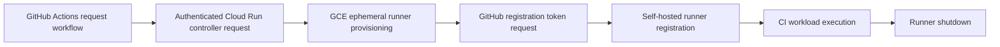

# GitHub Integration Validation

## Purpose

This document records historical evidence for the implemented GitHub Actions / GitHub REST API integration and ephemeral self-hosted runner lifecycle.

## Integration Flow

The implemented flow is:

GitHub Actions request workflow -> authenticated Cloud Run controller request -> GCE ephemeral runner provisioning -> GitHub registration token request -> self-hosted runner registration -> CI workload execution -> runner shutdown.

## Validation Evidence

The following GitHub Actions runs were retrieved read-only from GitHub on 2026-09-09. Times are UTC.

| Stage | Workflow | Run ID | Result | Date | Branch | Commit SHA | Evidence |
| --- | --- | --- | --- | --- | --- | --- | --- |
| Runner request | Request Ephemeral Runner | `21850574756` | Success | 2026-02-10 03:30:23 UTC | `main` | `72771679394ada5a57a9db89702d4a0368f6da2e` | [GitHub Actions run](https://github.com/DimitryZH/ci-build-platform/actions/runs/21850574756) |
| CI workload | Build and Push Docker Image | `21850583706` | Success | 2026-02-10 03:30:53 UTC | `main` | `72771679394ada5a57a9db89702d4a0368f6da2e` | [GitHub Actions run](https://github.com/DimitryZH/ci-build-platform/actions/runs/21850583706) |

The build run was triggered by `workflow_run` after the request workflow. GitHub's job metadata confirms that the `build` job was assigned a runner. The build workflow file retrieved from GitHub at the recorded commit configures that job with `runs-on: [self-hosted, gce, ephemeral]`.

## What the Evidence Demonstrates

The evidence demonstrates that:

- The runner-request workflow completed successfully.
- The subsequent CI workflow completed successfully.
- The build workflow at the recorded commit was configured for the self-hosted `gce` / `ephemeral` runner, and GitHub assigned a runner to its `build` job.
- The repository implementation uses the GitHub REST registration-token endpoint documented in [github-integration.md](github-integration.md).

GitHub Actions run metadata does not independently prove every internal Terraform or GCP operation. The runner provisioning, registration-token request, and shutdown behaviors are documented by the repository implementation references below, rather than inferred solely from GitHub Actions status.

## Implementation References

- [Runner startup script](../runner/startup-script.sh)
- [Runner request workflow](../.github/workflows/request-runner.yml)
- [Build workflow](../.github/workflows/build-and-push.yml)
- [GitHub integration documentation](github-integration.md)

## Validation Scope

This document records historical successful validation. No GitHub Actions workflows were triggered and no infrastructure was provisioned, modified, or deleted for this documentation update.
