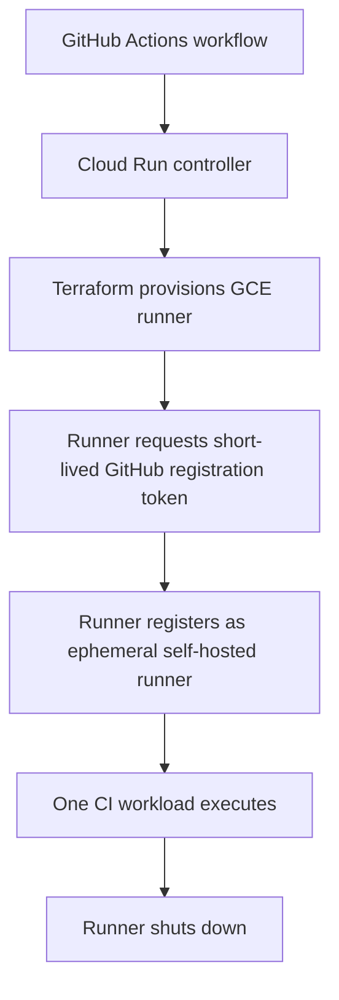

# GitHub Integration

## Purpose

This project provides a GCP-based CI platform that provisions short-lived self-hosted GitHub Actions runners on Google Compute Engine (GCE).

The integration allows GitHub Actions workflows to request temporary runner capacity from a Cloud Run controller. The controller uses Terraform to provision a GCE runner VM, and the runner registers back with GitHub as an ephemeral self-hosted runner for CI execution.

## Integration Flow

The implemented workflow follows this sequence:

GitHub Actions workflow -> Cloud Run controller -> Terraform provisions a GCE runner -> runner requests a short-lived GitHub registration token -> runner registers as an ephemeral self-hosted GitHub Actions runner -> one CI workload executes -> runner shuts down after completion.



The request workflow calls the Cloud Run controller using the `CLOUD_RUN_CONTROLLER_URL` and `CLOUD_RUN_TOKEN` GitHub secrets. The build workflow is configured to run on a self-hosted runner with the `gce` and `ephemeral` labels. The current repository configuration uses a manual `workflow_dispatch` trigger because the demo GCP infrastructure is not kept running continuously.

## GitHub REST API Usage

The existing GitHub REST API integration is the runner registration-token request in `runner/startup-script.sh`:

```text
POST /repos/{owner}/{repo}/actions/runners/registration-token
```

The runner startup script calls this endpoint with the configured GitHub credential. GitHub returns a short-lived registration token, and the script passes that token to the GitHub Actions runner configuration command.

That short-lived token is used only to register the temporary self-hosted runner for the target repository. The reviewed repository files do not show additional GitHub REST API endpoints used by the project.

## Authentication and Secrets

GitHub credentials and Cloud Run controller credentials are treated as secrets and must not be committed to the repository.

The deployment guide describes the relevant configuration:

- `github_token` is provided as a sensitive Terraform variable, commonly through `TF_VAR_github_token`, and is injected into the runner startup script so the runner can request the short-lived registration token.
- `controller_token` is provided as a sensitive Terraform variable, commonly through `TF_VAR_controller_token`, and must match the `CLOUD_RUN_TOKEN` GitHub secret used by `.github/workflows/request-runner.yml`.
- `CLOUD_RUN_CONTROLLER_URL` is stored as a GitHub Actions secret and points the workflow to the Cloud Run controller endpoint.
- Docker registry credentials are also stored as GitHub Actions secrets for the build workflow.

The request workflow sends `X-Controller-Token`, and the controller application compares it with `GITHUB_CONTROLLER_TOKEN`. This is application-level shared-secret validation; it is not Cloud Run IAM caller authentication.

See [`deployment_guide.md`](deployment_guide.md) for the deployment steps and secret configuration details.

No real token values are stored or documented here.

## Security Model

The existing implementation uses the following security-relevant properties:

- Ephemeral GitHub Actions runners are configured with `--ephemeral`.
- The build workflow targets self-hosted runners labeled `gce` and `ephemeral`.
- One CI workload is intended to execute on each temporary runner.
- The runner startup script shuts down the VM after the runner process exits.
- No active shared runner remains available for additional GitHub Actions jobs after job completion.
- The Terraform-managed GCE instance resource may remain after shutdown, typically in a stopped state; the `--ephemeral` behavior applies to the GitHub runner registration rather than deleting the VM resource.
- GitHub credentials and controller credentials are stored outside source code.
- The deployment model separates the runner service account from the controller service account.
- GCP IAM roles are assigned to those service accounts for their separate platform responsibilities.
- Runner shutdown is automated by the startup script.

These properties are based on the current repository implementation and deployment documentation.

## Validation

Successful GitHub Actions runs demonstrate the end-to-end workflow from runner request through execution on a self-hosted ephemeral runner.

See [github-integration-validation.md](github-integration-validation.md) for verified historical workflow-run evidence.

The relevant validation path is:

1. The `Request Ephemeral Runner` workflow calls the Cloud Run controller.
2. The controller provisions or ensures the GCE runner through Terraform.
3. The GCE runner starts, requests a short-lived GitHub registration token, and registers with GitHub using the `gce` and `ephemeral` labels.
4. The `Build and Push Docker Image` workflow runs on `[self-hosted, gce, ephemeral]`.
5. The runner shuts down after the workload completes.

This file does not include run IDs or validation dates because those are not documented in the reviewed repository files.

## Project Status

This is a working engineering project with an implemented GitHub API integration.
