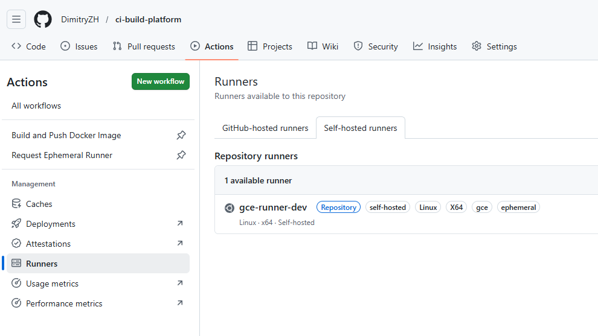
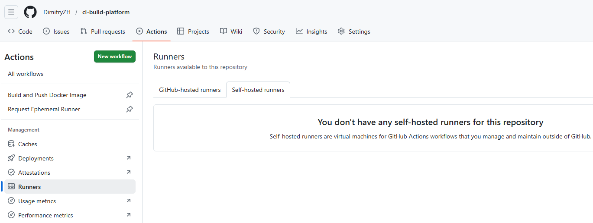

# Troubleshooting Guide

This guide documents real issues encountered while implementing GCP Self-Hosted CI Build Platform for GitHub Actions project across:

- Cloud Run controller
- GCE runner provisioning

It serves both as hands-on troubleshooting work (supported by GitHub Actions logs and screenshots under `docs/assets`) and as a professional runbook to fix these issues.

Each issue is structured with:

- **Symptom** – how the problem surfaces (pipeline failure, HTTP error, etc.)
- **Root Cause** – what was actually wrong
- **Resolution** – the concrete fix that resolved it
- **Prevention / Best Practices** – how to avoid it in future environments.

---

## Issue 1 – Cloud Run controller returns 403 and build job waits for runner

### Symptom

- GitHub workflow **“Request Ephemeral Runner”** (see [`.github/workflows/request-runner.yml`](.github/workflows/request-runner.yml:1)) appears successful.
- The **“Build and Push Docker Image”** workflow (see [`.github/workflows/build-and-push.yml`](.github/workflows/build-and-push.yml:1)) shows:

  ```text
  Requested labels: self-hosted, gce, ephemeral
  Waiting for a runner to pick up this job...
  ```

- Cloud Run logs for `ci-runner-controller` show HTTP 403 responses on `/run`.

### Root Cause

- The controller Flask app in [`cloudrun-controller/app/app.py`](cloudrun-controller/app/app.py:1) validates an application-level shared secret:

  ```python
  GITHUB_TOKEN = os.environ.get("GITHUB_CONTROLLER_TOKEN")

  @app.route("/run", methods=["POST"])
  def run():
      token = request.headers.get("X-Controller-Token")
      if token != GITHUB_TOKEN:
          return jsonify({"error": "unauthorized"}), 401
  ```

- `GITHUB_CONTROLLER_TOKEN` is set from `var.controller_token` in [`terraform/cloud-run-controller/main.tf`](terraform/cloud-run-controller/main.tf:39), while the workflow sends `X-Controller-Token` from the GitHub secret `CLOUD_RUN_TOKEN`.
- This is application-level shared-secret validation, not Cloud Run IAM caller authentication.
- Initially, these two values did **not** match, so every `/run` call failed and Terraform inside the controller never ran. No GCE runner VM was created; thus no runner existed to take the build job.

### Resolution

1. Generated a single strong random string to act as `controller_token`.
2. Used that exact value in two places:
   - As `TF_VAR_controller_token` when running `terraform -chdir=terraform apply` so [`variable "controller_token"`](terraform/variables.tf:55) and `GITHUB_CONTROLLER_TOKEN` get this value.
   - As the GitHub Actions secret `CLOUD_RUN_TOKEN` for repo `DimitryZH/ci-build-platform`.
3. Re-ran Terraform and triggered **Request Ephemeral Runner** again.

Result: `/run` returned HTTP 200, Terraform executed inside the controller, and the GCE runner could be provisioned.

### Prevention / Best Practices

- Treat `controller_token` as a **single logical secret** shared between Terraform/Cloud Run and GitHub; avoid multiple divergent values.
- Document the mapping clearly (see [`docs/deployment_guide.md`](docs/deployment_guide.md:231)).
- After changing secrets, validate `/run` manually with `curl` before relying on workflows.


---

## Issue 2 – Terraform inside controller prompting for missing variables

### Symptom

Cloud Run logs show Terraform prompting for variables and then failing:

```text
var.controller_image
  Container image for the Cloud Run controller
  Enter a value:

var.controller_service_account_email
  Service account email used by the Cloud Run controller
  Enter a value:
...
Error: No value for required variable
```

The Flask app returns HTTP 500 with:

```json
{"details":"Command '['terraform', 'apply', '-auto-approve']' returned non-zero exit status 1.","error":"terraform failed"}
```

### Root Cause

- Locally, non-sensitive root variables (for example, `controller_image` and `controller_service_account_email`) were provided via [`terraform/terraform.tfvars`](terraform/terraform.tfvars:237), while `github_token` and `controller_token` were provided through `TF_VAR_*` environment variables.
- Inside the controller container (`/workspace/terraform`), Terraform was executed by [`cloudrun-controller/app/app.py`](cloudrun-controller/app/app.py:16) **without** those variable values, so it prompted for input and then failed.

### Resolution

1. Extended the controller module variables in [`terraform/cloud-run-controller/variables.tf`](terraform/cloud-run-controller/variables.tf) to accept `runner_service_account_email` and `github_token`.
2. Passed these from the root module in [`terraform/main.tf`](terraform/main.tf) into the controller module.
3. Injected them into the controller container as `TF_VAR_*` env vars in [`terraform/cloud-run-controller/main.tf`](terraform/cloud-run-controller/main.tf), e.g.:

   ```hcl
   env {
     name  = "TF_VAR_github_token"
     value = var.github_token
   }

   env {
     name  = "TF_VAR_controller_token"
     value = var.controller_token
   }
   ```

4. Re-deployed the Cloud Run service via Terraform.

Terraform inside the controller stopped prompting and could run `apply` non-interactively.

### Prevention / Best Practices

- When Terraform runs inside an application container, explicitly pass all required root variables via `TF_VAR_*` or a `.tfvars` file included in the image.
- Keep a clear list in documentation of which variables are non-sensitive (`terraform.tfvars`) versus sensitive (`TF_VAR_*`).


---

## Issue 3 – `templatefile` and startup script path errors

### Symptom

Terraform (local or in Cloud Run) fails with errors such as:

```text
Invalid value for "vars" parameter: vars map does not contain key "RUNNER_VERSION"...

Invalid value for "vars" parameter: vars map does not contain key "GITHUB_TOKEN"...

Invalid value for "path" parameter: no file exists at "./../runner/startup-script.sh";
this function works only with files that are distributed as part of the configuration source code
```

### Root Cause

1. [`runner/startup-script.sh`](runner/startup-script.sh:1) used Terraform-style `${VAR}` notation:

   ```bash
   RUNNER_VERSION="2.317.0"
   curl ... v${RUNNER_VERSION}/actions-runner-linux-x64-${RUNNER_VERSION}.tar.gz
   ...
   -H "Authorization: token ${GITHUB_TOKEN}" \
   ```

   When processed via `templatefile()` in [`terraform/gce-runners/main.tf`](terraform/gce-runners/main.tf:21), Terraform attempted to substitute `${RUNNER_VERSION}` and `${GITHUB_TOKEN}` from the `vars` map but those keys were not provided.

2. The template path:

   ```hcl
   startup-script = templatefile("${path.root}/../runner/startup-script.sh", {...})
   ```

   resolved to different locations:
   - Locally: `<repo_root>/runner/startup-script.sh` (exists).
   - In controller: `/workspace/runner/startup-script.sh` (initially **not copied** into the image).

### Resolution

1. Changed the script to use pure shell variables:

   ```bash
   RUNNER_VERSION="2.317.0"
   curl ... v$RUNNER_VERSION/actions-runner-linux-x64-$RUNNER_VERSION.tar.gz

   REG_TOKEN=$(curl -s -X POST \
     -H "Authorization: token $GITHUB_TOKEN" \
     ...)
   ```

2. Updated the controller Dockerfile [`cloudrun-controller/Dockerfile`](cloudrun-controller/Dockerfile:19) to copy `runner/` into the path expected by Terraform inside the container:

   ```dockerfile
   COPY cloudrun-controller/app ./app
   COPY terraform ./terraform
   # Runner startup script directory for gce-runners module (templatefile path "../runner/startup-script.sh")
   # Local Terraform root: ./terraform → ../runner => <repo_root>/runner
   # Controller Terraform root: /workspace/terraform → ../runner => /workspace/runner
   COPY runner ./runner
   ```

3. Rebuilt and pushed the image; re-deployed the Cloud Run controller.

### Prevention / Best Practices

- Avoid `${VAR}` syntax in templates processed by Terraform; prefer `$VAR` and only interpolate through the `vars` map.
- Consider both **local** and **in-container** execution paths when designing `templatefile` paths. Use `path.root`/`path.module` plus Dockerfile COPY directives to keep behavior consistent.


---

## Issue 4 – IAM 403s for Cloud Run and Logging Metrics

### Symptom

Cloud Run logs for `/run` show Terraform failing with IAM errors such as:

```text
Error: Error when reading or editing CloudRunService ".../ci-runner-controller":
  googleapi: Error 403: Permission 'run.services.get' denied

Error: Error when reading or editing LoggingMetric "ci_runner_errors":
  googleapi: Error 403: Permission 'logging.logMetrics.get' denied

Error: Error when reading or editing LoggingMetric "ci_controller_errors":
  googleapi: Error 403: Permission 'logging.logMetrics.get' denied
```

### Root Cause

- The controller SA `ci-controller-sa@ci-build-platform.iam.gserviceaccount.com` initially lacked:
  - Cloud Run admin rights (`run.services.get`, `run.services.update`).
  - Logging metrics config rights (`logging.logMetrics.get`/`update`).

### Resolution

Granted additional roles to the controller SA:

```bash
# Cloud Run admin
gcloud projects add-iam-policy-binding ci-build-platform \
  --member="serviceAccount:ci-controller-sa@ci-build-platform.iam.gserviceaccount.com" \
  --role="roles/run.admin"

# Logging config writer for log-based metrics
gcloud projects add-iam-policy-binding ci-build-platform \
  --member="serviceAccount:ci-controller-sa@ci-build-platform.iam.gserviceaccount.com" \
  --role="roles/logging.configWriter"
```

After this, Terraform inside the controller could read/update Cloud Run services and log-based metrics without 403 errors.

### Prevention / Best Practices

- Derive IAM roles from the Terraform plan: for each resource Terraform reads/updates, ensure the controller SA has corresponding permissions.
- Start with broader roles while prototyping (`run.admin`, `logging.configWriter`), then harden later.


---

## Issue 5 – VM running but no self-hosted runner in GitHub

### Symptom

- GCE instance `ci-runner-dev` is in **RUNNING** (or STARTED) state in the Compute Engine console.
- No runner appears under GitHub → Settings → Actions → Runners.
- Build job continues to say "Waiting for a runner...".

### Root Cause

- The GitHub PAT used as `github_token` for the VM startup was invalid or under-scoped:
  - Manual curl to `.../actions/runners/registration-token` returned `401 Bad credentials` or `403 Resource not accessible by personal access token`.
- Therefore, the `curl` in [`runner/startup-script.sh`](runner/startup-script.sh) failed to obtain a registration token, and `./config.sh` never successfully registered a runner.

### Resolution

1. Created a **classic PAT** with minimal scopes for a public repo:
   - Scope: `public_repo`.
2. Verified with curl:

   ```bash
   curl -s -X POST \
     -H "Authorization: token <REAL_PAT>" \
     -H "Accept: application/vnd.github+json" \
     https://api.github.com/repos/DimitryZH/ci-build-platform/actions/runners/registration-token
   ```

   Received a JSON response containing a non-empty `"token"` and no error messages.

3. Used this PAT as `TF_VAR_github_token` when running Terraform locally and in the controller.
4. Reset the VM to rerun the startup script with the correct token.
5. Re-triggered the Request Runner workflow; the runner registered and appeared in GitHub.

### Prevention / Best Practices

- Always validate PATs directly against the target API before wiring them into Terraform or scripts.
- For fine-grained PATs, ensure both **Actions: Read and write** and **Administration: Read and write** permissions are granted for self-hosted runners.
- Store PATs in a password manager; pass via `TF_VAR_github_token`, never in committed files.

> GitHub Actions Runners settings page showing ci-runner-dev with labels self-hosted, gce, and ephemeral in the active runners list, confirming successful runner registration after PAT validation



---

## Issue 6 – “Ephemeral” runner vs. persistent GCE instance

### Symptom

- After a successful run:
  - GitHub self-hosted runner (labels `self-hosted`, `gce`, `ephemeral`) disappears from Settings → Actions → Runners.
  - GCE instance `ci-runner-dev` remains visible in the project, often in TERMINATED state.

### Root Cause

- The Terraform module [`terraform/gce-runners/main.tf`](terraform/gce-runners/main.tf) creates a **single named instance** `ci-runner-${environment}`.
- The ephemeral behavior is implemented at the **GitHub runner process** level, not at the VM resource level:
  - `--ephemeral` flag in [`runner/startup-script.sh`](runner/startup-script.sh) ensures the runner de-registers after one job.
  - `shutdown -h now` stops the VM after job completion.
- Terraform continues to own and manage the instance resource across runs.

### Resolution

- Accepted this as the intended design:
  - The instance resource is long-lived (managed by Terraform).  
  - The runner that registers with GitHub on that instance is ephemeral and disappears after each job.

### Prevention / Best Practices

- Clearly document that in this architecture:
  - The GCE instance persists, but typically runs only during jobs.  
  - The GitHub runner itself is ephemeral and visible only during job execution.  
  - The VM usually ends in a stopped/terminated state between runs.
- If true VM-level ephemerality is required, design a pattern where Terraform (or the controller) creates and destroys instances per job instead of reusing a single named instance.

> While no runner is listed in GitHub after a completed job.

---

This troubleshooting guide, together with [`docs/deployment_guide.md`](docs/deployment_guide.md), captures the real issues encountered while deploying this CI build platform and serves as a reusable runbook for future environments.

